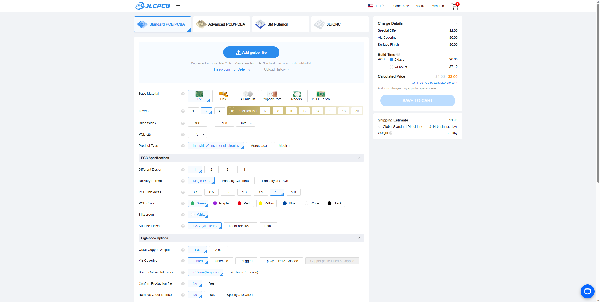
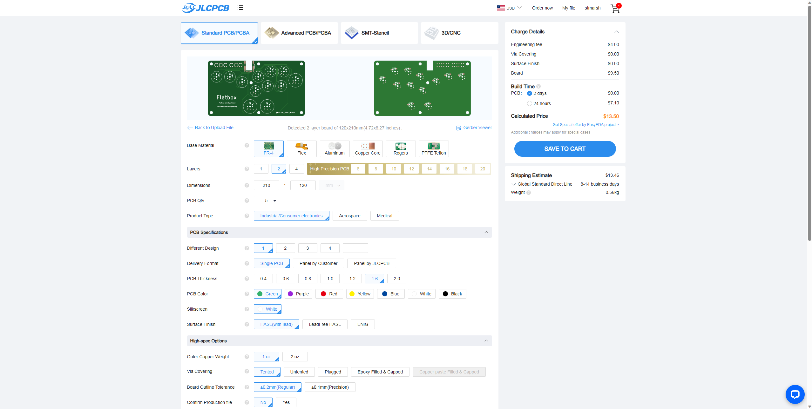
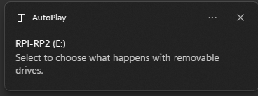
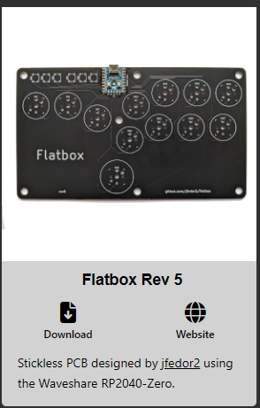
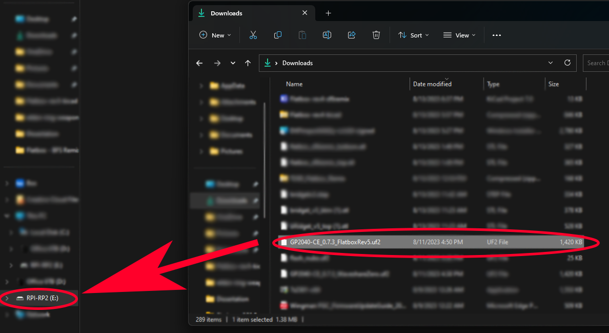
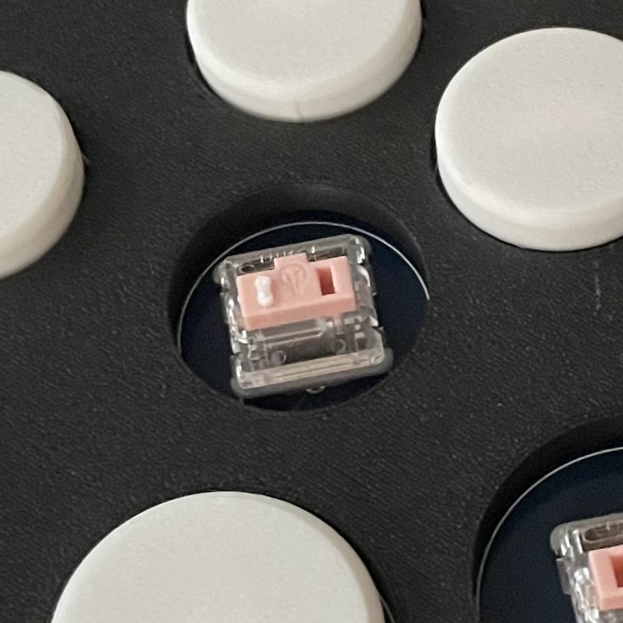
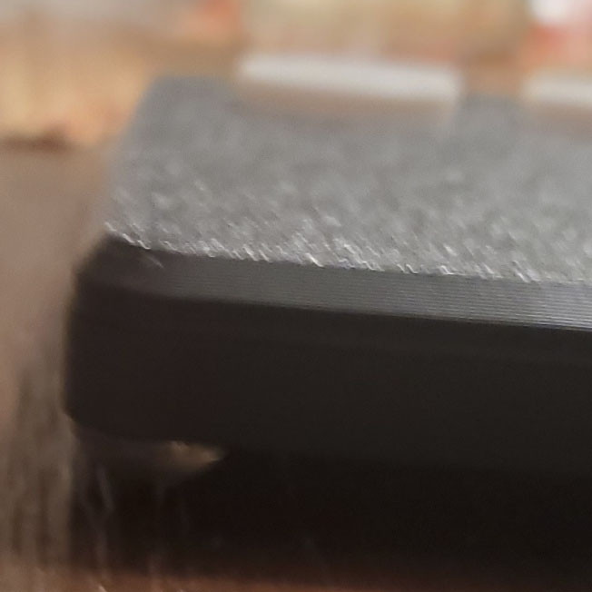

# Flatbox rev5

This is rev5 of the Flatbox. In this version an [RP2040-Zero](https://www.waveshare.com/rp2040-zero.htm) board is soldered onto the main PCB. This eliminates the need for SMT / SMD Assembly, which reduces the per-board cost from your PCB supplier (I use JLCPCB) in exchange for requiring slightly more soldering work from you. This makes it ideal for hobbyists and small board runs in general.

To make one unit you will need:

* [3D printed case parts](3d-printed-case), a top and a bottom;
* [The Flatbox PCB](pcb), ordered per the instructions below;
* [A RP2040-Zero](https://www.waveshare.com/rp2040-zero.htm), making sure you get the option **without header**;
* Twelve (12) [Kailh Choc v1 Low Profile switches](https://chosfox.com/collections/kailh-low-profile-switch-pg1350/products/kailh-low-profile-choc-switches) of your choice;
* Twelve (12) [Kailh Choc PG1350 hotswap sockets](https://chosfox.com/products/kailh-choc-switch-1350-hot-swap-sockets?_pos=1&_sid=1d99bca9e&_ss=r), optional but highly recommended;
* A set of [3D printed buttoncaps](../3d-printed-buttoncaps), nine (9) at 24mm size and three (3) at 30mm size;
* Six (6) [6x6x5mm tact switches](https://www.amazon.com/dp/B07VSNN9S2);
* Seven (7) [M3x6mm flat head screws](https://www.amazon.com/dp/B01E5EOIWW);
* Some kind of rubber feet (6mm / 0.25 in preferred) or non-slip padding for the bottom;
* A strong adhesive to attach the feet (I use epoxy);
* Non-marking tape, like blue painter's tape; and
* Soldering equipment.

## Ordering the Boards

I order my boards from [JLCPCB](https://jlcpcb.com/).

1. Make an account and sign in.

2. Click "order now" at the top right of the screen.

3. You will see the following page:

Download the Gerber files included in this repository, click the blue button that reads "Add Gerber file," and upload the Gerber file. It will need to be a .zip or .rar file for JLC to accept it.

4. You will then see the following page:

You can leave most of these settings at default, but for the sake of completeness, here are the settings I use:

* **Base Material**: FR-4 (default)  
* **Layers**: 2  
* **Dimensions**: auto-populated, do not adjust  
* **PCB Quantity**: As many as you want, minimum of 5. Avoid ordering more than 50 boards in one order, because if you order more than 50, you won't be able to use Single PCB delivery format, which will require extra processing from you.  
* **Product Type**: Industrial / Consumer Electronics  
* **Different Design**: 1  
* **Delivery Format**: Single PCB  
* **PCB Thickness**: 1.6  
* **PCB Color**: Up to you. Green boards will generally ship a day or two faster than other colors.  
* **Silkscreen**: This will auto-populate depending on your color choice. Every color except for White will have a white silkscreen; the White color will have a black silkscreen.  
* **Surface Finish**: HASL (with lead) or LeadFree HASL  
* **Outer Copper Weight**: 1 oz  
* **Via Covering**: Tented  
* **Board Outline Tolerance**: ±0.2mm (regular)  
* **Confirm Production File**: Up to you. I recommend Yes here, because it will allow you to double-check the board to make sure everything's right before JLCPCB makes it for a minimal cost.  
* **Remove Order Number**: Up to you; this is a cosmetic choice. JLCPCB will print the order number on your boards somewhere if you pick No. If you pick Yes, they won't, but the order will be slightly more expensive. I usually pick Yes.  
* **Flying Probe Test**: Fully test  
* **Gold Fingers**: No  
* **Castellated Holes**: No  
* **PCB Assembly**: No  
* **Stencil**: No  

For reference, as of this writing (August 2023), 5 boards with the above settings costs about $16 USD before shipping. 50 boards will cost about $70 USD before shipping.

5. Click "Save to Cart," check out, and complete your order.

## Assembling the PCB

1. Once you've received all your parts, set out your soldering workspace:

When soldering, make sure your workspace is clean and that you have adequate ventilation - this can be as simple as opening a window and running a fan away from your workspace. For this project, it's easy to do all of the work on a flat surface, so I just use non-marking, low-adhesion tape like blue painter's tape to hold down the PCB while I'm working on it. When working with solder, **make absolutely sure** that you wash your hands before and after soldering; do not eat or place your hands near your eyes or mouth while working; and make sure you ground yourself (either by using an anti-static wristband or by touching a grounded metal object, like the screw in a lightswitch plate) before you handle electronics.

2. Tape down your board and preheat your soldering iron per the standards for your solder. For standard leaded, rosin-core solder (what I use and recommend), I tend to work at 350 to 360°C, but you can go higher depending on your preferences.

3. Align the RP2040-Zero. You want to make sure that all of the castellated pins on the board (the silver areas with the small holes) align with the pads on the PCB.

4. Tape down the RP2040-Zero. You only need to leave a couple of pins at the bottom exposed for now - once those are soldered, the board will hold in place and you can remove the tape.

If you prefer, it's also possible to apply some solder to the pad in the top-left and in the bottom right, place the board, and heat up the solder to set the board. I prefer the tape to minimize the number of times I have to pass over the same pad.

5. Solder the bottom pins. To solder these, hold your preheated iron to the pin for a few (2-3) seconds, and then introduce the solder wire. 

You don't need to use a lot of solder; your goal is just to make sure that there is solder touching both the pad on the PCB and the side of the pin on the board, without any solder crossing over to any other pin or pad to the left or right. Using rosin flux makes this process *significantly* easier. You can either buy rosin on its own or buy solder wire with a rosin core. I prefer the latter. You can use the tip of your iron to "paint" the solder so that it's contacting both the pin and the pad.

When you're done with the bottom pins, it should look something like this:

6. Remove the tape and solder the rest of the pins:

Note that not all of the pins on the RP2040 are used in the layout of the Flatbox rev5, but I solder all of them for the sake of completeness and to better secure the board.

7. Prepare to place the tact switches. The housing for the switch will have a longer side and a shorter side with a foot in each of the four corners. Line up the switches so that the long side is parallel to the side of the PCB. This will be obvious when you do it; there's only one way they fit into the through-holes.

8. Push the legs of all six tact switches through the holes. Make sure that you push the legs *all* the way through the holes, or the tact switches won't sit right, and probably won't fit in the case. Make sure the housing is flat against the PCB, and on the bottom of the PCB, you can see the legs sticking through the holes:

9. Flip to the back of the board and solder in the tact switches. You will probably have to move the tape around your board a bit to be able to access all of the through-holes, depending on where you put it. Your goal is to get a tiny cone of solder around each of the four legs on all six switches. To do that, like before, hold your iron next to the leg for two or three seconds to heat it, and then melt a small amount of solder wire onto the leg. It doesn't have to be very pretty. As long as there's solder around the leg, you're in good shape. It should look something like this:

10. Place your hotswap sockets as pictured, aligning them within the footprints at the top of each switch location. **Be careful! Hotswap sockets are very light and easy to lose.** You will probably have to leave a couple off the board for the time being depending on the placement of your tape.

*Note: If you're soldering your switches directly to the PCB, you'll use the other two holes on the switch footprint, which are through-holes and identifiable because there is metal around the circumference of the hole.*

11. Solder on one of the two pins of the hotswap socket. Because the sockets are light, you want to make sure that as you solder on the first pad, the socket stays in its holes and flat against the PCB. 

There are two ways to do this. The first is to repeat the standard process of holding your iron against the pin for two to three seconds to heat it up and then melting solder to connect the pin to the pad. The second is to melt solder onto the pad, place the hotswap socket, and *then* reintroduce your iron to liquefy the solder and bind the pin to the pad, like so:

I'm agnostic between these two methods. I tend to do the first (just heating the pin), but find that I sometimes do need to apply the soldering pen to the area again because the socket fell out of position. Again, this doesn't need to be very pretty, nor do you need to use much solder. You just have to make sure there's solder on *both* the socket's pin and the PCB's pad. It'll look something like this:

12. Solder the other pin of the socket onto the corresponding pad.

13. Repeat steps 11 and 12 until all twelve of the sockets are soldered:

14. Congratulations! Your board is soldered.

15. Wash your hands and collect your board and your Kailh Choc switches.

16. Begin to place your switches. Make sure the metal pins on your switches are straight. Place your switch in the footprint, lining up the metal pins with the hotswap socket:

17. Push the switch into the socket. If you find that your socket comes loose from the board when you do so, go back to your soldering station and reattach the socket, making sure that you have solder on *both* the pin and the pad. When a socket gets dislodged for me, it's usually because the solder didn't make contact with the pad.

18. Repeat steps 16 and 17 until all of your switches are inserted. Congrats! At this point, your Flatbox PCB is assembled.

## Flashing the firmware

At this point, even if you don't have a case, your Flatbox is capable of working once the firmware is installed. This version of the Flatbox is designed for GP2040-CE, an open-source game controller firmware available for free online.

1. Plug a USB-C cable into your PCB, but do not plug it into a computer yet.

2. Press and hold the BOOT button on the RP2040-Zero and, while holding the button, plug the other end of your cable into a computer. If you did it right, your computer should notify you that a drive called "RPI-RP2" has been connected. This is your PCB's memory.

3. Go to the [GP2040-CE download page](https://gp2040-ce.info/#/download) and download the firmware for the Flatbox rev 5:

4. Find the .uf2 file you just downloaded. It should have a file name that looks something like this:

5. Drag and drop this .uf2 file onto the RPI-RP2 drive:

6. Wait for about 15 seconds. On my computer, a progress chart will pop up while the file is copying, and when it's done, it closes this window and ejects the drive.

7. While your board is still plugged in, test it to make sure everything works as expected. You can do this with a gamepad tester, like [GamepadTester.net](https://gamepadtester.net/), or you can open a game and test it in training mode. I tend to do both: check the inputs on the tester first, and then open Street Fighter 6 and test it there. In the SF6 control settings, Classic Inputs Custom 1 will set the 30mm right thumb button to Parry (MP+MK)  and the fourth column 30mm button to Drive Impact (HP+HK).

8. If everything works, your board is ready to play! If you have any trouble with the firmware, one troubleshooting step is to download the [Flash Nuke .uf2 file](https://raw.githubusercontent.com/OpenStickCommunity/GP2040-CE/main/docs/downloads/flash_nuke.uf2) from the GP2040-CE site, drag and drop it onto your PCB's memory drive (which will erase any firmware), and then re-drag and drop the Flatbox Rev5 firmware onto the drive.

## Installing the case

You will need to get a [3D printed case](3d-printed-case) and a set of [button caps](3d-printed-case/buttons) to proceed through this section. The files for the case and buttons are available on this repo, though Flatbox button caps designed for Choc v1 switches obtained elsewhere should also work.

1. Get the bottom portion of your case, your rubber feet (if using), and your adhesive.

2. Dispense your adhesive and, if necessary, mix it. 

Epoxy ususally comes in two portions that need to be mixed together for the substance to set, for example. Follow the directions for your adhesive.

3. Apply your adhesive to where you want your feet to go. I tend to place mine in the corners. Use a small, fine implement - I use a toothpick - to "paint" in the adhesive, ensuring you don't use too much or it'll leak onto other parts of the case.

4. Attach your feet, being careful to avoid adhesive leakage if possible and to clean any leaks promptly.

5. If necessary, allow your adhesive to cure fully before proceeding. The epoxy I use takes about an hour to cure.

6. Gather your completed PCB, your case, your button caps, your M3x6mm screws, and a compatible screwdriver.

7. One by one, align your button caps with the openings of your switches. 

Note that the 3D printed button caps used for this step (available on this repo) are *extremely* fragile and have a tendency to break at the stem. Be very careful pushing in the caps; use a light touch and make sure you have extras. 

Push in the cap.

If a stem breaks inside of your switch, you can carefully remove it with a pair of tweezers. 

Remember to only remove the caps with the board outside of the case, and to grab the rim and pull straight up. Attempting to wiggle the button cap out of the switch will cause it to break.

Continue until all of your button caps are placed.

8. Place the top of your case over the top of your board, lining up the mounting posts in the case with the mounting holes in the PCB.

9. Place the bottom of your case so that the screw holes on the bottom line up with the mounting holes on the top. They should roughly click together, but will not snap together decisively.

10. Begin to place your screws. Do not fully tighten them; just screw them in enough for a light hold. 

Criss-cross your case as you place them, as if you were tightening the bolts on a car wheel. 

If you printed your case out of PLA, the machine screws recommended on this repo will be able to "bite" into the plastic on their own. Note that if you print out of a firmer material, you may need to use self-tapping screws. If you do, be careful to avoid piercing through the top of your case.

11. When all of your screws are placed, begin to tighten them in. Keep a close eye on the flatness of the case as you do this. I find that if I tighten in all the screws all the way, some case flex inevitably gets introduced:

Tighen them only as much as possible without introducing any flex in the case.

12. Once you've installed your case, go back to your computer or console and test it again to make sure everything still functions as expected and that you like the feel of your switches.

**Congratulations! Your Flatbox rev5 - Bug from Streets™ Remix is now complete and ready for anything.**

---

PCB design licensed under [CC BY-SA 4.0](https://creativecommons.org/licenses/by-sa/4.0/).

PCB design uses the following:

* [keyswitches.pretty](https://github.com/daprice/keyswitches.pretty) by [daprice](https://github.com/daprice) ([CC BY-SA 4.0](https://creativecommons.org/licenses/by-sa/4.0/))
* RP2040-Zero STEP file downloaded from [Waveshare wiki](https://www.waveshare.com/wiki/RP2040-Zero)
